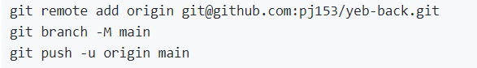

## github 提交

```git
git remote add origin git@github.com:pj153/yeb-back.git
git branch -M main
git push -u origin main
```

## docker创建mysql容器
```bash
docker run --name mysql -e MYSQL_ROOT_PASSWORD=qwer1234 -p 3306:3306 -v /root/docker/mysql/conf:/etc/mysql/conf.d -v /root/docker/mysql/data:/var/lib/mysql -d mysql:8.0.29
```